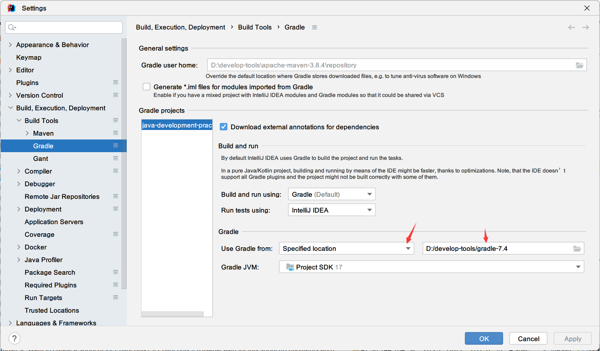

<!-- the line below needs to be an empty line C: (its because kramdown isnt
     that smart and dearly wants an empty line before a heading to be able to
     display it as such, e.g. website) -->

# Java Development Practice

<!-- ALL-CONTRIBUTORS-BADGE:START - Do not remove or modify this section -->

<!-- ALL-CONTRIBUTORS-BADGE:END -->

# Introduction

本站点主要记录Java生态系统中常用框架或第三方库的笔记，尤其是Java核心、Spring框架全家桶系统、持久层框架、测试库、Apache项目。  
所有的文章都有对应的源代码和测试代码。你可以克隆该项目并直接在你的机器上运行。

# Getting Started

该项目使用`Java 17` + `Gradle 7.4` + `Intellij IDEA 2022.2`构建，同时支持使用`Maven`。  
如果你的机器上并没有安装`Gradle`及配置相应的环境。你可以在使用`IDEA`打开克隆的该项目时选择`Maven`作为依赖管理工具。

如果你想使用`Gradle`，请确保你的机器上配置类相应的环境。
并在`IDEA`中转到`Settings > Build,Execution,Deployment > Build Tools > Gradle`：

在上述配置中选择你自己机器上安装的`Gradle`路径。或者你也可以使用`Gradle Wrapper`。

# Table Of Contents

* java-core
    - java-core-concurrency
        + [java-core-concurrency-basic](java-concurrency-simple/README.md)
        + [java-core-concurrency-advanced](java-concurrency-advanced-1/README.md)
        + [java-core-concurrency-collections](java-concurrency-collections-1/README.md)
* spring-framework
    - spring-core
    - spring-di
    - spring-aop
    - spring-caching
* spring-mvc
* spring-boot
* spring-data
* spring-security
* spring-cloud

# Contributors

<!-- ALL-CONTRIBUTORS-LIST:START - Do not remove or modify this section -->
<!-- prettier-ignore-start -->
<!-- markdownlint-disable -->
<table>
  <tr>
    <td align="center"><a href="https://github.com/tu-yucheng"> <b>tuyucheng</b></a> <a href="#projectManagement-tuyucheng" title="Project Management">📆</a> <a href="#maintenance-tuyucheng" title="Maintenance">🚧</a> <a href="#content-tuyucheng" title="Content">🖋</a></td>
  </tr>
</table>