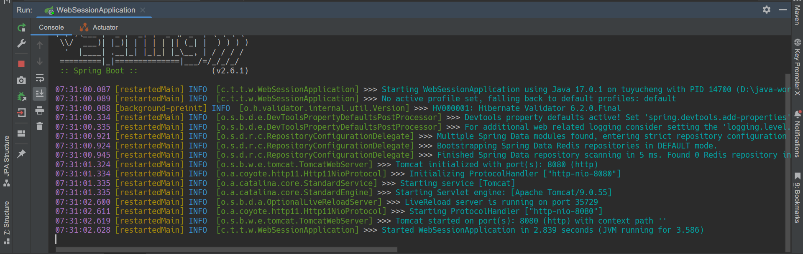
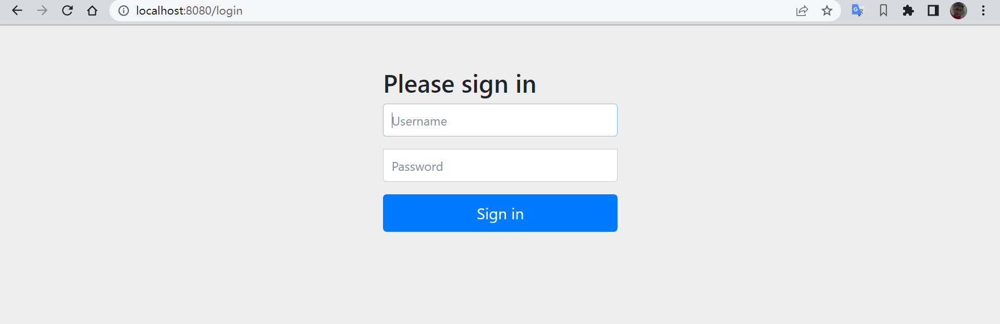
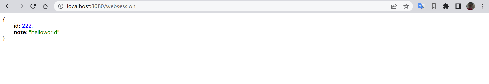

## 1. 概述

在本文中，我们将学习如何将Spring Session与Spring WebFlux结合使用。
具体来说，我们将学习如何使用Spring WebSession，它将Spring Session与Spring Boot 2的WebFlux结合起来。

Spring Session被定义为“name-values对的简化映射”。会话跟踪对HTTP会话很重要的值，例如用户和主体。
因此，我们可以将Session管理与新的响应式WebFlux Mono和Flux对象一起使用。
Spring Session还支持使用不同的应用程序容器(而不仅仅是Tomcat)。

## 2. Maven

首先，我们需要使用Spring Boot 2.x.x以及相关的Spring Session依赖项。

```text
<dependency>
    <groupId>org.springframework.boot</groupId>
    <artifactId>spring-boot-starter-webflux</artifactId>
    <version>2.6.1</version>
</dependency>
<dependency>
    <groupId>org.springframework.boot</groupId>
    <artifactId>spring-boot-starter-security</artifactId>
    <version>2.6.1</version>
</dependency>
<dependency> 
    <groupId>org.springframework.session</groupId> 
    <artifactId>spring-session-core</artifactId> 
    <version>2.6.1</version> 
</dependency>
```

这三个依赖项是内存会话管理的最低要求。对于Redis，我们需要添加：

```text
<dependency>
    <groupId>org.springframework.boot</groupId>
    <artifactId>spring-boot-starter-data-redis</artifactId>
    <version>2.6.1</version>
</dependency>
<dependency>
    <groupId>org.springframework.session</groupId>
    <artifactId>spring-session-data-redis</artifactId>
    <version>2.6.1</version>
 </dependency>
```

## 3. 内存配置

要使用内存配置，我们创建一个配置类：

```java

@Configuration
@EnableSpringWebSession
public class SessionConfig {

    @Bean
    public ReactiveSessionRepository reactiveSessionRepository() {
        return new ReactiveMapSessionRepository(new ConcurrentHashMap<>());
    }
}
```

它将(响应式)Repository与你的会话管理器相关联。将这些值存储到HashMap中。

重要的是，配置类必须包含@EnableSpringWebSession注解。

## 4. Redis配置

现在，让我们连接Redis。要使用Redis管理WebSessions，创建以下配置类：

```java

@Configuration
@EnableRedisWebSession
public class RedisConfig {

    @Bean
    public LettuceConnectionFactory redisConnectionFactory() {
        return new LettuceConnectionFactory();
    }
}
```

注意，配置类必须包含@EnableRedisWebSession注解。
请记住，我们不能同时使用@EnableRedisWebSession和EnableSpringWebSession注解。

Docker是与Redis交互的最简单方法之一。安装Docker后，我们只需要输入三个命令即可。运行命令以启动Redis实例：

```shell
docker stop redis
docker rm redis
docker run -d --name redis -p 6379:6379 redis:4.0.5-alpine
```

接下来，让我们测试我们的应用程序。

## 5. 实践

现在，让我们向我们的应用程序添加一个响应式REST控制器：

```java

@RestController
public class SessionController {

    @GetMapping("/websession/test")
    public Mono<CustomResponse> testWebSessionByParam(
            @RequestParam(value = "id") int id,
            @RequestParam(value = "note") String note,
            WebSession session) {

        session.getAttributes().put("id", id);
        session.getAttributes().put("note", note);

        CustomResponse r = new CustomResponse();
        r.setId((int) session.getAttributes().get("id"));
        r.setNote((String) session.getAttributes().get("note"));

        return Mono.just(r);
    }

    @GetMapping("/websession")
    public Mono<CustomResponse> getSession(WebSession session) {

        session.getAttributes().putIfAbsent("id", 0);
        session.getAttributes().putIfAbsent("note", "Howdy Cosmic Spheroid!");

        CustomResponse r = new CustomResponse();
        r.setId((int) session.getAttributes().get("id"));
        r.setNote((String) session.getAttributes().get("note"));

        return Mono.just(r);
    }
}
```

然后，我们可以通过向REST处理程序添加参数来使用WebSession。我们可以使用返回Map的getAttributes()方法获取或设置值。

现在启动我们的Spring应用程序：



然后我们可以访问localhost:8080，并显示Spring登录页面。使用默认登录凭据(-u admin -p password)：



验证后，我们可以更改默认的WebSession值(0和“Howdy Cosmic Spheroid！”)。运行curl命令：

```shell
curl -i -H "Accept: application/json" -H "Content-Type:application/json" -X GET http://localhost:8080/websession/test?id=222&note=helloworld
```

或访问URL http://localhost:8080/websession/test?id=222&note=helloworld。
此后，从localhost:8080/websession返回的JSON将显示更新后的Session值：



## 6. 总结

在本文中，我们学习了如何将Spring WebSession添加到我们的WebFlux应用程序中。